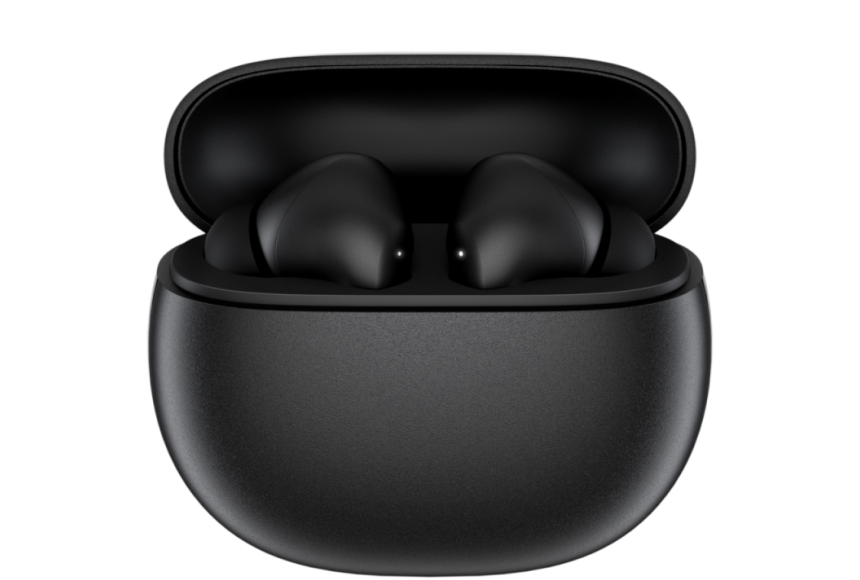
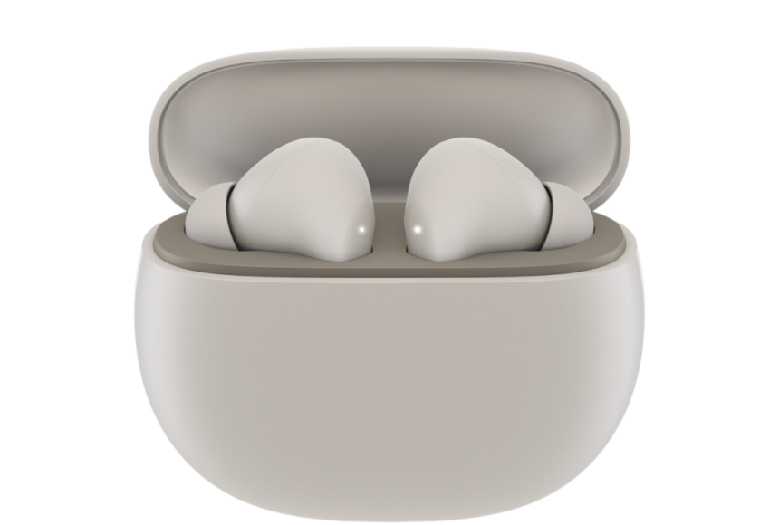
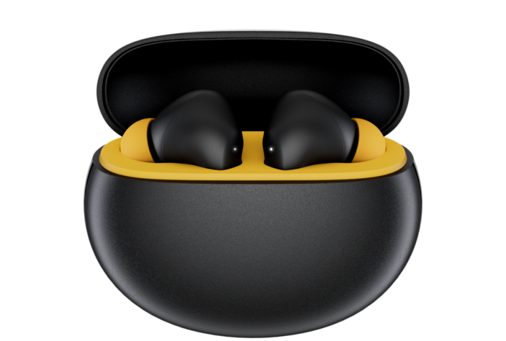
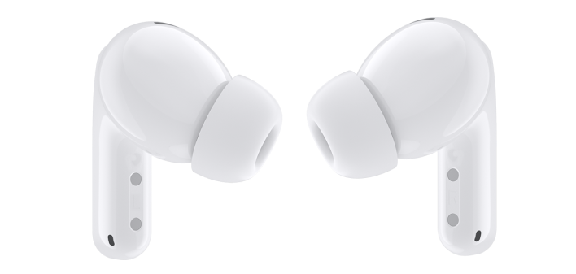
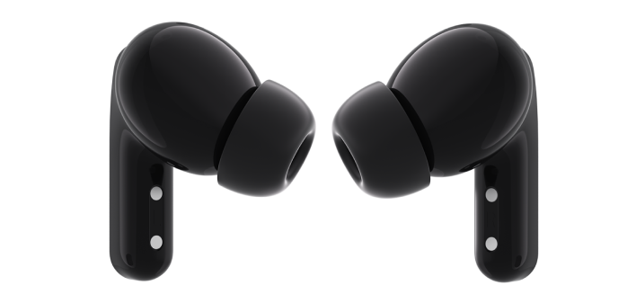
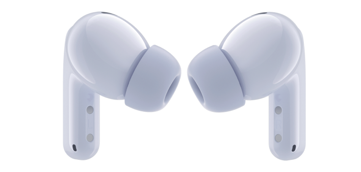
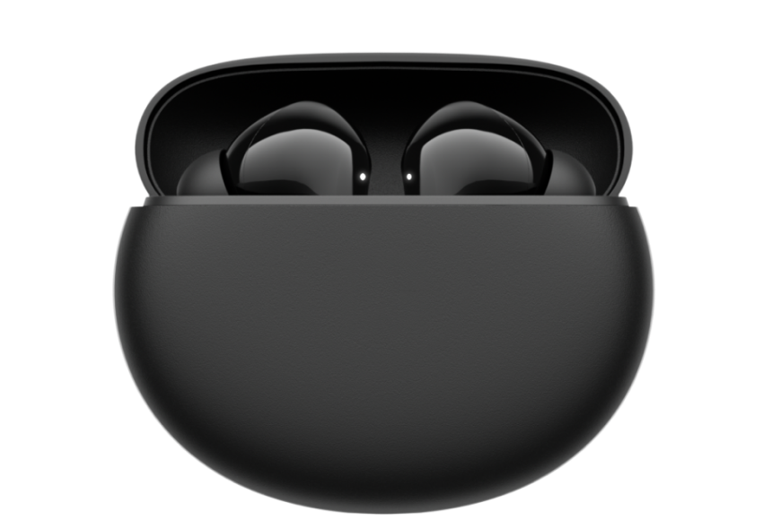
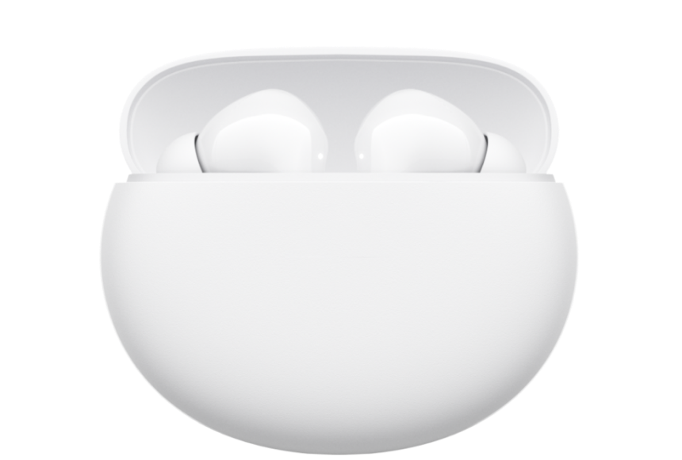
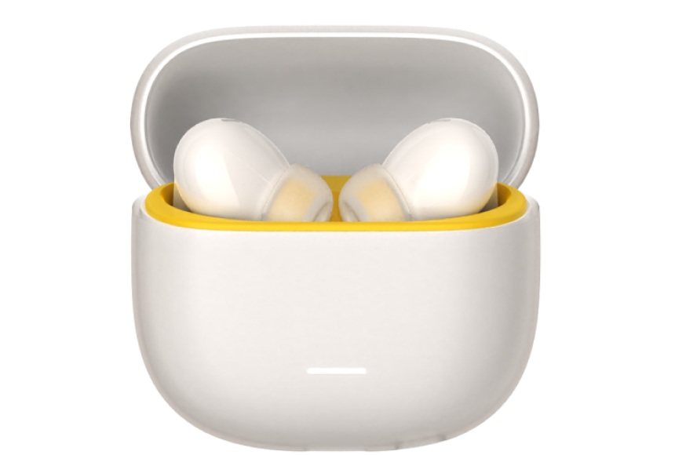

# Earbuds Models

Total models: 7

| Model | Name | Code | VID | PID | Case | Buds | Dynamic | Guide |
|------------|-------------|------|-----|-----|------|------|---------|-------|
| M2232E1 | Redmi Buds 4 Active | m79ari | 2717 | 5060 |  1  2 | — | — | [guide_1](./guide/m79ari_1_guide.json) |
| M2237E1 | POCO Pods | m79api | 2717 | 5062 |  3 | — | — | [guide_3](./guide/m79api_3_guide.json) |
| M2316E1 | Redmi Buds 5 | n77in | 2717 | 5087 |  1  2  3 |  1  2  3 | — | [guide_1](./guide/n77in_1_guide.json) [guide_2](./guide/n77in_2_guide.json) [guide_3](./guide/n77in_3_guide.json) |
| M2348E1 | Redmi Buds 5A | m79ii | 2717 | 508e |  1  2 | — | — | [guide_2](./guide/m79ii_2_guide.json) |
| M2349E1 | Redmi Buds 5C | n79ari | 2717 | 508c |  1  2  5 | — | — | [guide_2](./guide/n79ari_2_guide.json) |
| M2350E1 | POCO Buds X1 | n79api | 2717 | 508d |  6 | — | — | [guide_6](./guide/n79api_6_guide.json) |
| M2429E1 | Redmi Buds 6 | o77i | 2717 | 50a7 |  1  2  3 |  1  2  3 | — | [guide_1](./guide/o77i_1_guide.json) [guide_2](./guide/o77i_2_guide.json) [guide_3](./guide/o77i_3_guide.json) |
